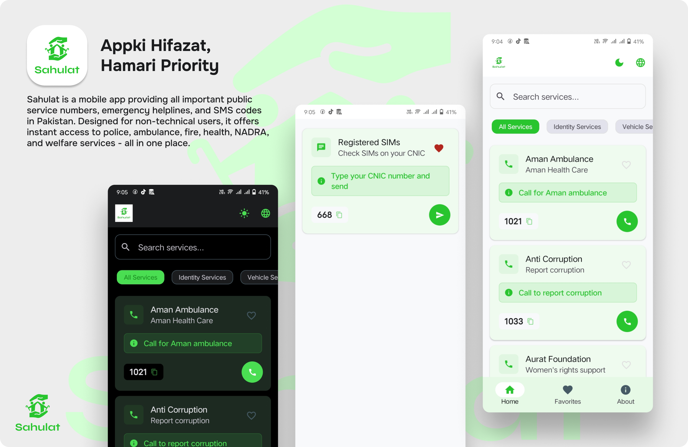

# Sahulat (سہولت) - Appki Hifazat, Hamari Priority

[](https://github.com/ChAbdulWahhab)
[](https://developer.android.com)
[](https://kotlinlang.org)
[](https://developer.android.com/jetpack/compose)

**Sahulat** is a premium, offline-first Android application designed to empower citizens of Pakistan with instant access to essential public services, emergency helplines, and verification codes. Built with a focus on accessibility and modern aesthetics.

## ✨ Key Features

- 🟢 **Vibrant Design** - Brand-new vibrant green theme (#28C52E) for a premium look and feel.
- 🌓 **Dual Theme Support** - Full Light and Dark mode support with a dedicated toggle.
- 📖 **User Guidance** - Visual instruction banners for non-technical users on every service card.
- 📶 **50+ Services** - Pre-loaded with Identity, Vehicle, Welfare, and Emergency services.
- 🌍 **Bilingual UI** - Seamless switching between **English** and **Urdu**.
- 🔍 **Global Search** - Intelligent search system for finding services instantly.
- ⭐ **Favorites** - Save your most-used services for quick access.
- 🔋 **Offline First** - Zero internet required. All data is stored securely on your device.

## 📱 Service Categories

### 🆔 Identity & Documents
- CNIC Verification (8000)
- Registered SIMs Check (668)
- Vote & Polling Info (8300)
- NADRA & Passport Tracking

### 🚑 Emergency & Health
- Unified Emergency (911)
- Police Assistance (15)
- Rescue 1122 & Ambulance Services
- Cyber Crime & Anti-Corruption

### 🚗 Vehicle & Licensing
- Punjab/ICT Car Registration
- Driving License Verification
- MNP & Phone Ownership

### 🤝 Welfare & Support
- Benazir Income Support (8171)
- Sehat Card Information
- PM Youth & Rashan Programs

## 🛠 Tech Stack

- **Language:** Kotlin
- **UI Architecture:** Jetpack Compose (Material 3)
- **Pattern:** MVVM (Model-View-ViewModel)
- **Database:** Room Persistence Library
- **Concurrency:** Kotlin Coroutines & Flow
- **Minimum SDK:** API 24 (Android 7.0)

## 🚀 Getting Started

### Prerequisites
- Android Studio Ladybug or later
- JDK 17
- Android Device/Emulator (API 24+)

### Installation
1. Clone the repository:
   ```bash
   git clone https://github.com/ChAbdulWahhab/Sahulat.git
   ```
2. Open the project in Android Studio.
3. Let Gradle sync complete.
4. Run the app on your device.

## 📸 Screenshots

<p align="center">
  
</p>

## ⚖️ Disclaimer

This is an **unofficial** application. All data is sourced from public service providers. Sahulat does not represent any government entity. Service codes are subject to change by respective authorities.

## 👨‍💻 Author

**Ch Abdul Wahhab**
- GitHub: [@ChAbdulWahhab](https://github.com/ChAbdulWahhab)

---

**Made with ❤️ in Pakistan** 🇵🇰
